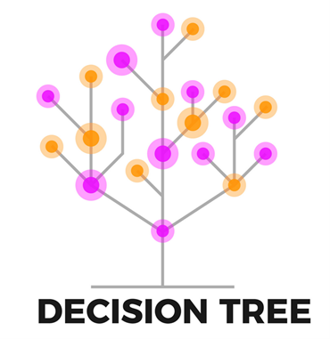

# Decision Tree Algorithm

The Decision Tree Algorithm is a supervised machine learning algorithm. A decision tree allows the classification or regression of data.

You can access my article on the topic through the Medium link: https://medium.com/@ozgurmehmetakif/decision-tree-algorithm-1c7f672e160b

Konu hakkındaki yazıma Medium linkinden ulaşabilirsiniz: https://medium.com/@ozgurmehmetakif/karar-a%C4%9Fac%C4%B1-algoritmas%C4%B1-decision-tree-algorithm-9f69acd8b5bd
  
