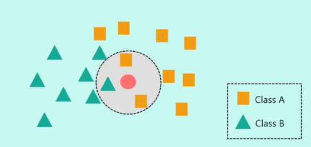

# K-Nearest Neighbors Algorithm

The k-Nearest Neighbors algorithm (KNN) is a supervised machine learning classification algorithm. 'K' represents the number of nearest neighbors the classifier will use to make predictions.

The k-Nearest Neighbors algorithm is a distance-based algorithm. Its fundamental working principle involves classifying data by using the distances and similarities between them. In this technique, data is stored in a pattern space. When data of an unknown class is presented, the algorithm identifies the k nearest data points to determine the class of the unknown data. Subsequently, the data is labeled with the class of the k nearest neighbors to which it bears the most resemblance.

You can access my article on the topic through the Medium link: https://medium.com/@ozgurmehmetakif/k-nearest-neighbors-algorithm-32aefcc46efd

Konu hakkındaki yazıma Medium linkinden ulaşabilirsiniz: https://medium.com/@ozgurmehmetakif/en-yak%C4%B1n-k-kom%C5%9Fu-algoritmas%C4%B1-k-nearest-neighbors-algorithm-f69cd84f8ddd
  
