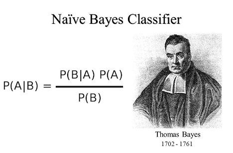

# Naive Bayes Algorithm

Naive Bayes Algorithm is a supervised machine learning classification algorithm based on Bayes' Theorem.

Like other supervised learning algorithms, Naive Bayes Algorithm uses the features of known data to predict the class of the data to be classified. The algorithm assumes that the features of each data point are independent of each other, which is a naive assumption since in reality, these features may be dependent on each other. Despite the interdependence of features in real life, the algorithm is termed 'naive' because it simplistically assumes independence.

You can access my article on the topic through the Medium link: https://medium.com/@ozgurmehmetakif/naive-bayes-algorithm-d15d7062b0d6

Konu hakkındaki yazıma Medium linkinden ulaşabilirsiniz: https://medium.com/@ozgurmehmetakif/naive-bayes-alogritmas%C4%B1-naive-bayes-algorithm-39ecfc2c398c
  
