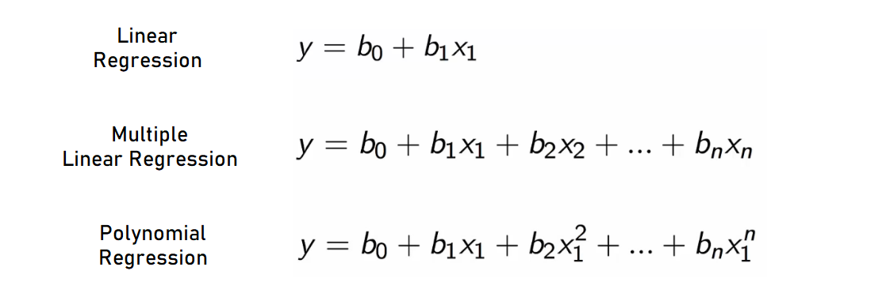

# Regression

  In this notebook, we will learn what Simple Linear Regression, Multiple Linear Regression, and Polynomial Regression are, and we will make examples of how their models are implemented with the Scikit-learn library. Then, we will evaluate the Linear Regression and Polynomial Regression models together with the R-Square method.
  